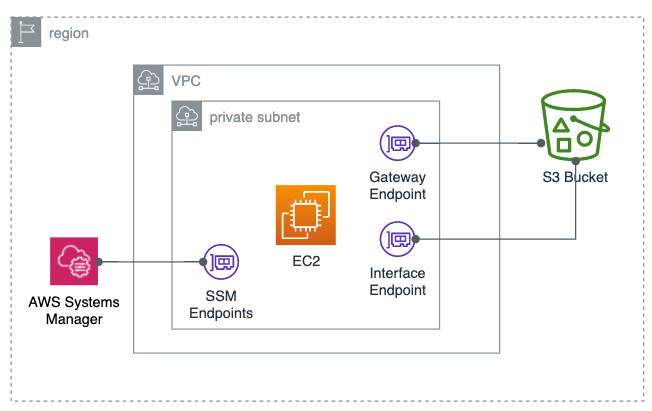
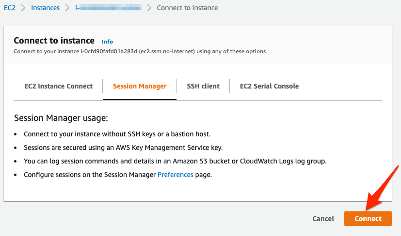
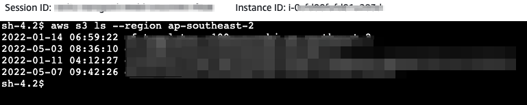
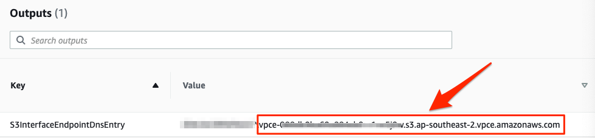
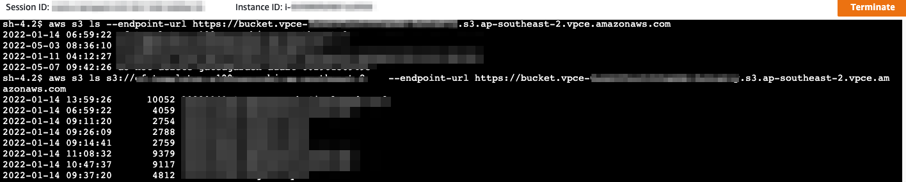

# S3-gatewayendpoint-privatelink-privatesubnet

This working example is used to demostrate how to configure S3 gateway endpoint and S3 privatelink in the same VPC,  which doesn't not have any inbound or outbound internet access.
Enterprise customer who has very strict cyber security control requirement in place normally use Gateway Endpoint to access S3. With the new S3 PrivateLink feature, customers can now can configure secured access to their data in S3 bucket from on-premise network. 

What's the difference between Gateway Endpoint and PrivateLink? Can they work together in the same VPC? Any requirement on the firewalls to make this setup work?

By deploying the single cloudformation file, you will get an example to demostrate, 

* A fully private VPC without any inbound or outbound internet access.
* A gateway endpoint to access S3 bucket.
* A PrivateLink to access S3 bucket.
* A demo EC2 deployed inside the private subnet with System Manager Agent pre-installed.
   * This EC2 is used to test accessibility to S3 via both endpoints.




Please note,

* The demo focus on configurations to demonstrate to have both endpoints work at the same time in fully private subnet
* Endpoint policy is configured to allow full S3 access for testing purpose and should be updated to least privileged policy in production.


## How to deploy 

This sample runs in ap-southeast-2 region, if you want to use other region, please update S3PrefixList parameter while deploying the cloudformation.

```
aws cloudformation deploy --template-file ./privatevpc-ec2ssm-s3endpoints.yml --stack-name privatevpc-ec2ssm-s3endpoints --capabilities CAPABILITY_NAMED_IAM
```

## How to test

Once the CloudFormation Template is deployed, you can test the deployment.
Because the both of the S3 endpoints are created in the VPC without any inbound/outbound internet access, a good way to test the endpoints is from the EC2 instance runs inside the VPC. The EC2 has System Manager Agent installed, we can connect to the EC2 via session manager.



Once connected, we can run command from the EC2 to verify the connectivity to S3 via both enpoints.

* To access S3 bucket via Gateway Endpoint:

```bash
# List all buckets via S3 Gateway Endpoint
aws s3 ls --region ap-southeast-2
# List contents from a bucket named mybucket via S3 Gateway Endpoint
# mybucket must be created in same region as Gateway Endpoint. 
aws s3 ls s3://mybucket --region ap-southeast-2
```


* To access S3 bucket via PrivateLink:
  * The {S3InterfaceEndpointDnsEntry} is the DNS entry of the S3InterfaceEndpoint. You can find the entry from the VPC endpoint console where the S3 PrivateLink is created or you can directly copy it from the CloudFormation output.



Here's an example of the command to interact with S3 buckets via PrivateLink:

```bash
# List all buckets via S3 PrivateLink using example endpoint dns entry
aws s3 ls --endpoint-url https://bucket.vpce-111111111111-aaaaaaaa.s3.ap-southeast-2.vpce.amazonaws.com
# List contents from a bucket named mybucket via S3 PrivateLink 
# mybucket must be created in same region as S3 PrivateLink; 
# You can run the same command from another VPC or On-Premises that has connectivity with current VPC and be able to access the bucket via PrivateLink.
aws s3 ls s3://mybucket --endpoint-url https://bucket.vpce-111111111111-aaaaaaaa.s3.ap-southeast-2.vpce.amazonaws.com

```



## How to tear down the environment

At the end of the test, you can delete the stack by running below command or manually delete the "privatevpc-ec2ssm-s3endpoints" from AWS console.

```
aws cloudformation delete-stack --stack-name privatevpc-ec2ssm-s3endpoints
```

## Reference Link

vpce-gateway route table explained
>
https://docs.aws.amazon.com/vpc/latest/privatelink/vpce-gateway.html

AWS PrivateLink for Amazon S3
>
https://docs.aws.amazon.com/AmazonS3/latest/userguide/privatelink-interface-endpoints.html

## Security

See [CONTRIBUTING](CONTRIBUTING.md#security-issue-notifications) for more information.

## License

This library is licensed under the MIT-0 License. See the LICENSE file.
